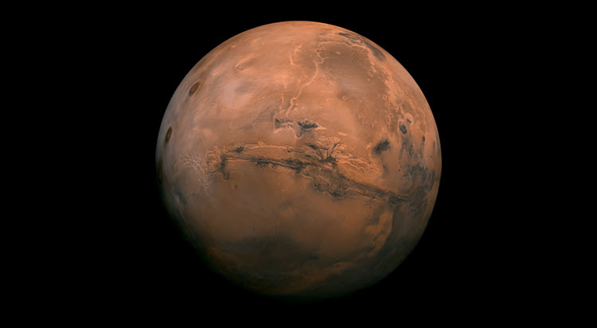
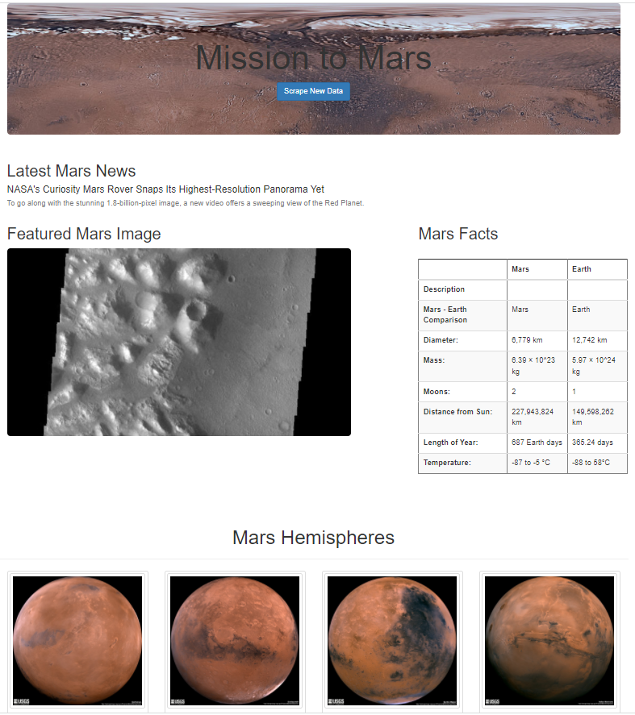

# Mission-to_Mars
---

## Overview
---

This project scrapes websites for information and images about Mars, then displays the information on a webpage. I used Python to scrape the websites and then created a website using Flask and Bootstrap to format and display the results. The scraped data is stored in a Mongo database and can be refreshed using the "Scrape New Data" button to retrieve new information. The HTML was revised to be responsive to different screen sizes, from desktop computers to mobile phones.

## Resources
---
- Python
- Jupyter Notebook
- Bootstrap 3
- HTML
- MongoDB
- Beautiful Soup, Pandas, Splinter, ChromeDriverManager, Flask, PyMongo

## Scrape Websites
---
This is the website created after scraping the websites listed below.

### Latest Mars News

Website: https://redplanetscience.com/
Retrieve the most recent news article title along with its summary from Red Planet Science.

### Featured Mars Image
Website: https://spaceimages-mars.com
Retrieve the featured Mars image from the Jet Propulsion Laboratory's Space Images website.

### Mars Facts
Website: https://galaxyfacts-mars.com
Retrieve table of facts about Mars from Mars Facts.

### Mars Hemispheres
Website: https://marshemispheres.com/
Retrieve images and titles of Mars hemispheres

